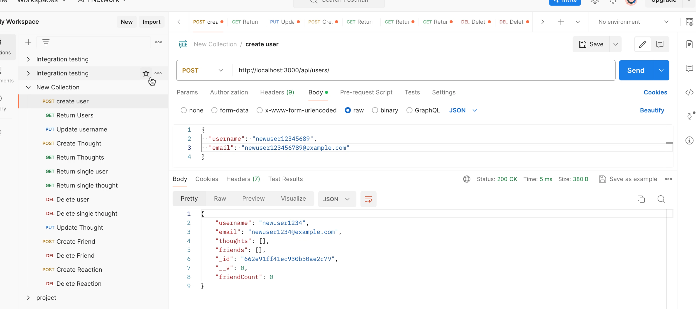

# social-network

## Description 
This project is a backend API for a social network web application where users can share their thoughts, react to friends' thoughts, and manage a friend list. The API is built with Node.js, Express.js, and MongoDB.

## Table of Contents 
- [Installation](#Installation)
- [Usage](#Usage)
- [License](#License)
- [Contributing](#Contributing)
- [Tests](#Tests)
- [Questions](#Questions)

## Installation 
To install this project, please clone the repoository to your local machine and run 'npm install' to install the necessary dependencies. 

## Usage

Users can be retrieved using a GET request to /api/users, which lists all users, or /api/users/:id to fetch a specific user by their unique identifier. To add a new user to the system, clients should send a POST request to /api/users with the user's username and email in the JSON. If updates are necessary, a PUT request can be made to /api/users/:id, allowing changes such as email or username updates. Users can be deleted from the system by sending a DELETE request to /api/users/:id.

Clients can retrieve all thoughts or a specific thought by making GET requests to /api/thoughts and /api/thoughts/:id, respectively. Creating a new thought involves sending a POST request to /api/thoughts with the thought text, the username of the creator, and the user's ID in the body. Thoughts can be updated via PUT requests to /api/thoughts/:id and removed using a DELETE request to the same endpoint.

To add a friend, a POST request should be sent to /api/users/:userId/friends/:friendId, where userId is the ID of the user who is adding the friend, and friendId is the ID of the user to be added as a friend. Similarly, to remove a friend, clients should send a DELETE request to /api/users/:userId/friends/:friendId.

To add a reaction, send a POST request to /api/thoughts/:thoughtId/reactions with details of the reaction in the request body. To delete a reaction, a DELETE request should be sent to /api/thoughts/:thoughtId/reactions/:reactionId, specifying both the thought ID and the reaction ID.

## License 
This project is licensed under the MIT License.

## Contributing 
N/A

## Tests
N/A

## Questions
GitHub Profile: [bwolson31](https://github.com/bwolson31)

For additional questions, contact me via email: bwolson31@gmail.com

(https://www.youtube.com/watch?v=uiXnlbw3g0Q)